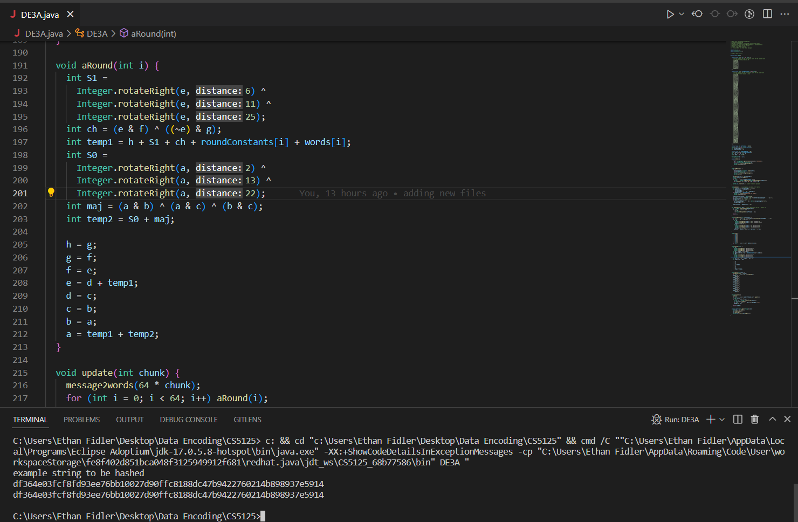

# Assignment 1

Ethan Fidler, 1/18/2023

## Output from java code



## Code

```java
// DE3A.java CS5125/6025 cheng 2023
// implementing SHA-256
// based on wikipedia's pseudocode (see lecture notes)
// compared to java.security.MessageDigest's implementation
// digests displayed as hex strings
// usage: java DE3A < message
//  or java DE3A and then enter message

import java.io.*;
import java.security.*;

// import java.util.*;

public class DE3A {

  static final int[] iv = new int[] {
    // first 32 bits of the fractional parts of the square roots
    // of the first 8 primes 2..19
    0x6a09e667,
    0xbb67ae85,
    0x3c6ef372,
    0xa54ff53a,
    0x510e527f,
    0x9b05688c,
    0x1f83d9ab,
    0x5be0cd19,
  };

  static final int[] roundConstants = new int[] {
    // first 32 bits of the fractional parts of the cube roots
    // of the first 64 primes 2..311
    0x428a2f98,
    0x71374491,
    0xb5c0fbcf,
    0xe9b5dba5,
    0x3956c25b,
    0x59f111f1,
    0x923f82a4,
    0xab1c5ed5,
    0xd807aa98,
    0x12835b01,
    0x243185be,
    0x550c7dc3,
    0x72be5d74,
    0x80deb1fe,
    0x9bdc06a7,
    0xc19bf174,
    0xe49b69c1,
    0xefbe4786,
    0x0fc19dc6,
    0x240ca1cc,
    0x2de92c6f,
    0x4a7484aa,
    0x5cb0a9dc,
    0x76f988da,
    0x983e5152,
    0xa831c66d,
    0xb00327c8,
    0xbf597fc7,
    0xc6e00bf3,
    0xd5a79147,
    0x06ca6351,
    0x14292967,
    0x27b70a85,
    0x2e1b2138,
    0x4d2c6dfc,
    0x53380d13,
    0x650a7354,
    0x766a0abb,
    0x81c2c92e,
    0x92722c85,
    0xa2bfe8a1,
    0xa81a664b,
    0xc24b8b70,
    0xc76c51a3,
    0xd192e819,
    0xd6990624,
    0xf40e3585,
    0x106aa070,
    0x19a4c116,
    0x1e376c08,
    0x2748774c,
    0x34b0bcb5,
    0x391c0cb3,
    0x4ed8aa4a,
    0x5b9cca4f,
    0x682e6ff3,
    0x748f82ee,
    0x78a5636f,
    0x84c87814,
    0x8cc70208,
    0x90befffa,
    0xa4506ceb,
    0xbef9a3f7,
    0xc67178f2,
  };

  static final int bufferSize = 16348;
  byte[] buffer = new byte[bufferSize];
  int messageLength = 0;
  int numberOfChunks = 0;

  static final int numberOfRounds = 64;
  int[] words = new int[numberOfRounds];
  int a, b, c, d, e, f, g, h;
  int[] hash = new int[8];

  MessageDigest md = null;

  public DE3A() {
    try {
      md = MessageDigest.getInstance("SHA-256");
    } catch (NoSuchAlgorithmException e) {
      System.err.println(e.getMessage());
      System.exit(1);
    }
  }

  void readMessage() {
    try {
      messageLength = System.in.read(buffer);
    } catch (IOException e) {
      System.err.println(e.getMessage());
      System.exit(1);
    }
    md.update(buffer, 0, messageLength);
    byte[] digest = md.digest();
    String t = "";
    for (int i = 0; i < digest.length; i++) {
      String h = Integer.toHexString(Byte.toUnsignedInt(digest[i]));
      if (h.length() == 1) t += "0" + h; else t += h;
    }
    System.out.println(t); // digest from Java package
  }

  void padding() { // multiple of 512 bits or 64 bytes
    int remainder = (messageLength + 9) % 64;
    int paddedLength = remainder == 0
      ? messageLength + 9
      : messageLength + 9 + (64 - remainder);
    if (paddedLength > bufferSize) {
      System.err.println("message too long");
      System.exit(1);
    }
    buffer[messageLength] = (byte) 0x80;
    for (int i = 0; i < remainder + 4; i++) buffer[messageLength + 1 + i] = 0;
    messageLength *= 8; // now in bits
    for (int i = 0; i < 4; i++) {
      buffer[paddedLength - 1 - i] = (byte) (messageLength & 0xff);
      messageLength >>= 8;
    }
    numberOfChunks = paddedLength / 64;
  }

  int bytes2word(int pos) { // four bytes from pos to a 32-bit int
    int w = Byte.toUnsignedInt(buffer[pos]);
    for (int i = 1; i < 4; i++) {
      w <<= 8;
      w |= Byte.toUnsignedInt(buffer[pos + i]);
    }
    return w;
  }

  void message2words(int chunkBegins) {
    for (int i = 0; i < 16; i++) words[i] = bytes2word(chunkBegins + i * 4);
    for (int i = 16; i < 64; i++) {
      int s0 =
        Integer.rotateRight(words[i - 15], 7) ^
        Integer.rotateRight(words[i - 15], 18) ^
        words[i - 15] >>> 3;
      int s1 =
        Integer.rotateRight(words[i - 2], 17) ^
        Integer.rotateRight(words[i - 2], 19) ^
        words[i - 2] >>> 10;
      words[i] = words[i - 16] + s0 + words[i - 7] + s1;
    }
  }

  void initH() {
    a = iv[0];
    b = iv[1];
    c = iv[2];
    d = iv[3];
    e = iv[4];
    f = iv[5];
    g = iv[6];
    h = iv[7];
    for (int i = 0; i < 8; i++) hash[i] = iv[i];
  }

  void aRound(int i) {
    int S1 =
      Integer.rotateRight(e, 6) ^
      Integer.rotateRight(e, 11) ^
      Integer.rotateRight(e, 25);
    int ch = (e & f) ^ ((~e) & g);
    int temp1 = h + S1 + ch + roundConstants[i] + words[i];
    int S0 =
      Integer.rotateRight(a, 2) ^
      Integer.rotateRight(a, 13) ^
      Integer.rotateRight(a, 22);
    int maj = (a & b) ^ (a & c) ^ (b & c);
    int temp2 = S0 + maj;

    h = g;
    g = f;
    f = e;
    e = d + temp1;
    d = c;
    c = b;
    b = a;
    a = temp1 + temp2;
  }

  void update(int chunk) {
    message2words(64 * chunk);
    for (int i = 0; i < 64; i++) aRound(i);
    hash[0] += a;
    a = hash[0];
    hash[1] += b;
    b = hash[1];
    hash[2] += c;
    c = hash[2];
    hash[3] += d;
    d = hash[3];
    hash[4] += e;
    e = hash[4];
    hash[5] += f;
    f = hash[5];
    hash[6] += g;
    g = hash[6];
    hash[7] += h;
    h = hash[7];
  }

  String digest() {
    initH();
    for (int i = 0; i < numberOfChunks; i++) update(i);
    String hashHex = "";
    for (int i = 0; i < 8; i++) {
      String str = Integer.toHexString(hash[i]);
      int len = str.length();
      for (int j = 0; j < 8 - len; j++) hashHex += "0";
      hashHex += str;
    }
    return hashHex;
  }

  public static void main(String[] args) {
    DE3A de3 = new DE3A();
    de3.readMessage();
    de3.padding();
    System.out.println(de3.digest());
  }
}

```
