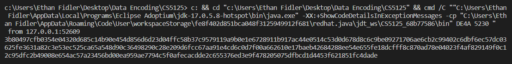
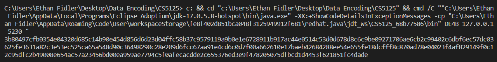
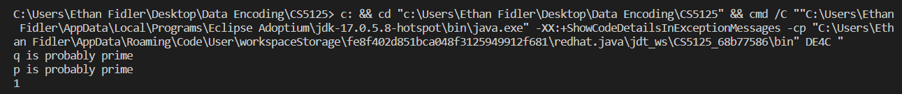

# Assignment 2

Ethan Fidler, 1/27/2023

## DE4A

### A Output



### A Code

```java
import java.io.*;
import java.math.*;
import java.net.*;
import java.util.*;

public class DE4A {

  static int MAXBF = 1024;
  String hexQ = null;
  BigInteger q = null;
  static BigInteger alpha = new BigInteger("2");
  BigInteger privateKey;
  BigInteger publicKey;
  BigInteger clientPublicKey;
  byte[] publicKeyBytes = null;
  BigInteger preMasterSecret;
  String hexkey = null;

  void readQ(String filename) {
    Scanner in = null;
    try {
      in = new Scanner(new File(filename));
    } catch (FileNotFoundException e) {
      System.err.println(filename + " not found");
      System.exit(1);
    }
    hexQ = in.nextLine();
    in.close();
    q = new BigInteger(hexQ, 16);
  }

  void generateKeyPair() {
    Random random = new Random();
    privateKey = new BigInteger(1235, random);
    publicKey = alpha.modPow(privateKey, q);
    publicKeyBytes = publicKey.toByteArray();
  }

  void runUDPServer(int serverPort) {
    DatagramSocket ds = null;
    DatagramPacket dp = null;
    byte[] buff = new byte[MAXBF];
    try {
      ds = new DatagramSocket(serverPort);
      dp = new DatagramPacket(buff, MAXBF);
      ds.receive(dp); // blocking until receiving
      int len = dp.getLength();
      byte[] clientPublicKeyBytes = new byte[len];
      for (int i = 0; i < len; i++) clientPublicKeyBytes[i] = buff[i];
      clientPublicKey = new BigInteger(clientPublicKeyBytes);
      InetAddress iadd = dp.getAddress(); // client's IP address
      int clientPort = dp.getPort();
      System.out.println(" from " + iadd.getHostAddress() + ":" + clientPort);
      dp =
        new DatagramPacket(
          publicKeyBytes,
          publicKeyBytes.length,
          iadd,
          clientPort
        );
      ds.send(dp);
    } catch (IOException e) {
      System.err.println("IOException");
      return;
    }
  }

  void computeSharedSecret() {
    preMasterSecret = clientPublicKey.modPow(privateKey, q); // public^private mod q
    hexkey = preMasterSecret.toString(16);
    System.out.println(hexkey);
  }

  public static void main(String[] args) {
    if (args.length < 1) {
      System.err.println("Usage: java DE4A port");
      System.exit(1);
    }
    DE4A de4 = new DE4A();
    de4.readQ("DHgroup5.txt");
    de4.generateKeyPair();
    de4.runUDPServer(Integer.parseInt(args[0]));
    de4.computeSharedSecret();
  }
}
```

## DE4B

### B Output



### B Code

```java
import java.io.*;
import java.util.*;
import java.math.*;
import java.net.*;

public class DE4B{
  static int MAXBF = 1024;
  String hexQ = null;
  BigInteger q = null;
  static BigInteger alpha = new BigInteger("2");
  BigInteger privateKey;
  BigInteger publicKey;
  BigInteger serverPublicKey;
  byte[] publicKeyBytes = null;
  BigInteger preMasterSecret;
  String hexkey = null;

  void readQ(String filename){
    Scanner in = null;
    try {
     in = new Scanner(new File(filename));
    } catch (FileNotFoundException e){
      System.err.println(filename + " not found");
      System.exit(1);
    }
    hexQ = in.nextLine();
    in.close();
    q = new BigInteger(hexQ, 16);
  }

 void generateKeyPair(){
   Random random = new Random();
   privateKey = new BigInteger(1235, random);
   publicKey = alpha.modPow(privateKey, q);
   publicKeyBytes = publicKey.toByteArray();
 }

  void runUDPClient(String serverIP, int serverPort){
   InetAddress iadd = null;
   try {
     iadd = InetAddress.getByName(serverIP);
   } catch (UnknownHostException e){
     System.err.println("Exception");
     return;
   }
   DatagramSocket ds = null;
   DatagramPacket dp = null;
   byte[] buff = new byte[MAXBF];
   try {
     ds = new DatagramSocket();
     dp = new DatagramPacket(publicKeyBytes, publicKeyBytes.length, iadd, serverPort);
     ds.send(dp);
     dp = new DatagramPacket(buff, MAXBF);
     ds.receive(dp);
     int len = dp.getLength();
     byte[] serverPublicKeyBytes = new byte[len];
     for (int i = 0; i < len; i++) serverPublicKeyBytes[i] = buff[i];
     serverPublicKey = new BigInteger(serverPublicKeyBytes);
   } catch (IOException e){
     System.err.println("IOException");
     return;
   }
}

 void computeSharedSecret(){
    preMasterSecret = serverPublicKey.modPow(privateKey, q); // public^private mod q
    hexkey = preMasterSecret.toString(16);
    System.out.println(hexkey);
 }

 public static void main(String[] args){
   if (args.length < 2){
     System.err.println("Usage: java DE4B serverIP serverPort");
     System.exit(1);
   }
   DE4B de4 = new DE4B();
   de4.readQ("DHgroup5.txt");
   de4.generateKeyPair();
   de4.runUDPClient(args[0], Integer.parseInt(args[1]));
   de4.computeSharedSecret();
 }
}
```

## DE4C

### C Output



### C Code

```java
import java.math.*;
import java.io.*;
import java.util.*;

public class DE4C{
  String hexQ = null;
  BigInteger q = null;
  BigInteger p = null;  // p = (q-1)/ 2
  static BigInteger two = new BigInteger("2");

  void readQ(String filename){
    Scanner in = null;
    try {
     in = new Scanner(new File(filename));
    } catch (FileNotFoundException e){
      System.err.println(filename + " not found");
      System.exit(1);
    }
    hexQ = in.nextLine();
    in.close();
    q = new BigInteger(hexQ, 16);
  }

 void testPrimality(){
   if (q.isProbablePrime(200)) 
    System.out.println("q is probably prime");
   p = q.subtract(BigInteger.ONE).divide(BigInteger.valueOf(2));
   if (p.isProbablePrime(200)) 
    System.out.println("p is probably prime");
 }

 void testPrimitiveness(){
   BigInteger twoPQ = BigInteger.valueOf(2).modPow(p, q); // compute pow(2, p) mod q
   System.out.println(twoPQ.toString(16));
 }

 public static void main(String[] args){
   DE4C de4 = new DE4C();
   de4.readQ("DHgroup5.txt");
   de4.testPrimality();
   de4.testPrimitiveness();
 }
}
```