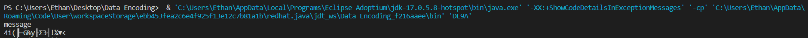
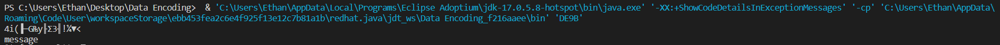
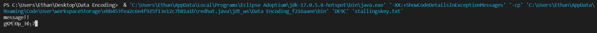

# Assignment 6

Ethan Fidler 2/15/2023

## Output

I don't think The test files were properly or consistently readable by my computer or IDE and I am not confident in me having correctly used them.







D Output goes here!
I could not finish D, providing all other answers.


## Code

### DE9A

```java
public class DE8A{

  static final int numberOfBits = 8;
  static final int fieldSize = 1 << numberOfBits;
  static final int irreducible = 0x11b;
  static final int logBase = 3;
  static final byte[][] A = new byte[][] {
            {1, 1, 1, 1, 1, 0, 0, 0},
            {0, 1, 1, 1, 1, 1, 0, 0},
 	    {0, 0, 1, 1, 1, 1, 1, 0},
            {0, 0, 0, 1, 1, 1, 1, 1},
	    {1, 0, 0, 0, 1, 1, 1, 1},
            {1, 1, 0, 0, 0, 1, 1, 1},
            {1, 1, 1, 0, 0, 0, 1, 1},
            {1, 1, 1, 1, 0, 0, 0, 1}
	};
  static final byte[] B = new byte[] { 0, 1, 1, 0, 0, 0, 1, 1};
  static final byte[][] G = new byte[][] {
            {2, 1, 1, 3},
            {3, 2, 1, 1},
            {1, 3, 2, 1},
            {1, 1, 3, 2}
        };
  static String hexkey = "0f1571c947d9e8590cb7add6af7f6798";  // Stallings key in "An AES Example"
  int[] alog = new int[fieldSize];
  int[] log = new int[fieldSize];
  int[] S = new int[fieldSize];
  static final int blockSize = 16;
  static final int numberOfRounds = 11;
  int[] state = new int[blockSize];
  int[][] roundKey = new int[numberOfRounds][blockSize];

  int modMultiply(int a, int b, int m){
    int product = 0;
    for (; b > 0; b >>= 1){
      if ((b & 1) > 0) product ^= a;
      a <<= 1;
      if ((a & fieldSize) > 0) a ^= m;
    }
    return product;
  }

  void makeLog(){
    alog[0] = 1;
    for (int i = 1; i < fieldSize; i++)
      alog[i] = modMultiply(logBase, alog[i - 1], irreducible);
    for (int i = 1; i < fieldSize; i++) log[alog[i]] = i;
  }

  int logMultiply(int a, int b){
    return (a == 0 || b == 0) ? 0 : alog[(log[a] + log[b]) % (fieldSize - 1)];
  }

  int multiplicativeInverse(int a){
    return alog[fieldSize - 1 - log[a]];
  }

  void buildS(){
     int[] bitColumn = new int[8];
     for (int i = 0; i < fieldSize; i++){
       int inverse = i < 2 ? i : multiplicativeInverse(i);
       for (int k = 0; k < 8; k++)
           bitColumn[k] = inverse >> (7 - k) & 1;
       S[i] = 0;
       for (int k = 0; k < 8; k++){
          int bit = B[k];
          for (int l = 0; l < 8; l++)
            if (bitColumn[l] == 1) bit ^= A[k][l];
          S[i] ^= bit << 7 - k;
       }
    }
  }

 int readBlock(){
   byte[] data = new byte[blockSize];
   int len = 0;
   try {
     len = System.in.read(data);
   } catch (IOException e){
     System.err.println(e.getMessage());
     System.exit(1);
   }
   if (len <= 0) return len;
   for (int i = 0; i < len; i++){
     if (data[i] < 0) state[i] = data[i] + fieldSize;
     else state[i] = data[i];
   }
   for (int i = len; i < blockSize; i++) state[i] = 0;
   return len;
 }

  void subBytes(){
    for (int i = 0; i < blockSize; i++)
      state[i] = S[state[i]];
  }

 void shiftRows(){
   int temp = state[2]; state[2] = state[10]; state[10] = temp;
   temp = state[6]; state[6] = state[14]; state[14] = temp;
   temp = state[1]; state[1] = state[5]; state[5] = state[9];
   state[9] = state[13]; state[13] = temp;
   temp = state[3]; state[3] = state[15]; state[15] = state[11];
   state[11] = state[7]; state[7] = temp;
 }

  void mixColumns(){
   int[] temp = new int[4];
   for (int k = 0; k < 4; k++){
    for (int i = 0; i < 4; i++){
      temp[i] = 0;
      for (int j = 0; j < 4; j++)
        temp[i] ^= logMultiply(G[j][i], state[k * 4 + j]);
    }
    for (int i = 0; i < 4; i++) state[k * 4 + i] = temp[i];
   }
  }

 void expandKey(){
   for (int i = 0; i < blockSize; i++) roundKey[0][i] =
     Integer.parseInt(hexkey.substring(i * 2, (i + 1) * 2), 16);
   int rcon = 1;
   for (int i = 1; i < numberOfRounds; i++){
     roundKey[i][0] = S[roundKey[i-1][13]] ^ rcon;
     rcon <<= 1; if (rcon > 0xFF) rcon ^= irreducible;
     roundKey[i][1] = S[roundKey[i-1][14]];
     roundKey[i][2] = S[roundKey[i-1][15]];
     roundKey[i][3] = S[roundKey[i-1][12]];
     for (int k = 0; k < 4; k++)
        roundKey[i][k] ^= roundKey[i-1][k];
     for (int k = 4; k < blockSize; k++)
        roundKey[i][k] = roundKey[i][k-4] ^ roundKey[i-1][k];
   }
 }

 void addRoundKey(int round){
   for (int k = 0; k < blockSize; k++)
      state[k] ^= roundKey[round][k];
 }

  void blockCipher(){
    addRoundKey(0);
    for (int i = 1; i < numberOfRounds; i++){
      subBytes();
      shiftRows();
      if (i < numberOfRounds - 1) mixColumns();
      addRoundKey(i);
    }
  }

 void writeBlock(){
   byte[] data = new byte[blockSize];
   for (int i = 0; i < blockSize; i++)
     data[i] = (byte)(state[i]);
   try {
     System.out.write(data);
   } catch (IOException e){
     System.err.println(e.getMessage());
     System.exit(1);
   }
 }

  void encrypt(){
    while (readBlock() > 0){
      blockCipher();
      writeBlock();
    }
    System.out.flush();
  }


public static void main(String[] args){
   DE8A de8 = new DE8A();
   de8.makeLog();
   de8.buildS();
   de8.expandKey();
   de8.encrypt();
}
}
```

### DE9B

```java
public class DE9B {

  static final int numberOfBits = 8;
  static final int fieldSize = 1 << numberOfBits;
  static final int irreducible = 0x11b;
  static final int logBase = 3;
  static final byte[][] A = new byte[][] {
            {1, 1, 1, 1, 1, 0, 0, 0},
            {0, 1, 1, 1, 1, 1, 0, 0},
 	    {0, 0, 1, 1, 1, 1, 1, 0},
            {0, 0, 0, 1, 1, 1, 1, 1},
	    {1, 0, 0, 0, 1, 1, 1, 1},
            {1, 1, 0, 0, 0, 1, 1, 1},
            {1, 1, 1, 0, 0, 0, 1, 1},
            {1, 1, 1, 1, 0, 0, 0, 1}
	};
  static final byte[] B = new byte[] { 0, 1, 1, 0, 0, 0, 1, 1};
  static final byte[][] Gi = new byte[][] {
            {14, 9, 13, 11},
            {11, 14, 9, 13},
            {13, 11, 14, 9},
            {9, 13, 11, 14}
        };
  static String hexkey = "0f1571c947d9e8590cb7add6af7f6798";  // Stallings key in "An AES Example"
  int[] alog = new int[fieldSize];
  int[] log = new int[fieldSize];
  int[] S = new int[fieldSize];
  int[] Si = new int[fieldSize];
  static final int blockSize = 16;
  static final int numberOfRounds = 11;
  int[] state = new int[blockSize];
  int[][] roundKey = new int[numberOfRounds][blockSize];

  int modMultiply(int a, int b, int m){
    int product = 0;
    for (; b > 0; b >>= 1){
      if ((b & 1) > 0) product ^= a;
      a <<= 1;
      if ((a & fieldSize) > 0) a ^= m;
    }
    return product;
  }

  void makeLog(){
    alog[0] = 1;
    for (int i = 1; i < fieldSize; i++)
      alog[i] = modMultiply(logBase, alog[i - 1], irreducible);
    for (int i = 1; i < fieldSize; i++) log[alog[i]] = i;
  }

  int logMultiply(int a, int b){
    return (a == 0 || b == 0) ? 0 : alog[(log[a] + log[b]) % (fieldSize - 1)];
  }

  int multiplicativeInverse(int a){
    return alog[fieldSize - 1 - log[a]];
  }

  void buildS(){
     int[] bitColumn = new int[8];
     for (int i = 0; i < fieldSize; i++){
       int inverse = i < 2 ? i : multiplicativeInverse(i);
       for (int k = 0; k < 8; k++)
           bitColumn[k] = inverse >> (7 - k) & 1;
       S[i] = 0;
       for (int k = 0; k < 8; k++){
          int bit = B[k];
          for (int l = 0; l < 8; l++)
            if (bitColumn[l] == 1) bit ^= A[k][l];
          S[i] ^= bit << 7 - k;
       }
       Si[S[i]] = i;
    }
  }

 int readBlock(){
   byte[] data = new byte[blockSize];
   int len = 0;
   try {
     len = System.in.read(data);
   } catch (IOException e){
     System.err.println(e.getMessage());
     System.exit(1);
   }
   if (len <= 0) return len;
   for (int i = 0; i < len; i++){
     if (data[i] < 0) state[i] = data[i] + fieldSize;
     else state[i] = data[i];
   }
   for (int i = len; i < blockSize; i++) state[i] = 0;
   return len;
 }

  void inverseSubBytes(){
    for (int i = 0; i < blockSize; i++)
      state[i] = Si[state[i]];
  }

 void inverseShiftRows(){
   int temp = state[2]; state[2] = state[10]; state[10] = temp;
   temp = state[6]; state[6] = state[14]; state[14] = temp;
   temp = state[1]; state[1] = state[13]; state[13] = state[9];
   state[9] = state[5]; state[5] = temp;
   temp = state[3]; state[3] = state[7]; state[7] = state[11];
   state[11] = state[15]; state[15] = temp;
 }

  void inverseMixColumns(){
   int[] temp = new int[4];
   for (int k = 0; k < 4; k++){
    for (int i = 0; i < 4; i++){
      temp[i] = 0;
      for (int j = 0; j < 4; j++)
        temp[i] ^= logMultiply(Gi[j][i], state[k * 4 + j]);
    }
    for (int i = 0; i < 4; i++) state[k * 4 + i] = temp[i];
   }
  }

 void expandKey(){
   for (int i = 0; i < blockSize; i++) roundKey[0][i] =
     Integer.parseInt(hexkey.substring(i * 2, (i + 1) * 2), 16);
   int rcon = 1;
   for (int i = 1; i < numberOfRounds; i++){
     roundKey[i][0] = S[roundKey[i-1][13]] ^ rcon;
     rcon <<= 1; if (rcon > 0xFF) rcon ^= irreducible;
     roundKey[i][1] = S[roundKey[i-1][14]];
     roundKey[i][2] = S[roundKey[i-1][15]];
     roundKey[i][3] = S[roundKey[i-1][12]];
     for (int k = 0; k < 4; k++)
        roundKey[i][k] ^= roundKey[i-1][k];
     for (int k = 4; k < blockSize; k++)
        roundKey[i][k] = roundKey[i][k-4] ^ roundKey[i-1][k];
   }
 }

 void inverseAddRoundKey(int round){  // Your code from DE1B
   for (int k = 0; k < blockSize; k++)
      state[k] ^= roundKey[numberOfRounds - 1 - round][k];
 }

  void blockDecipher(){
    inverseAddRoundKey(0);
    for (int i = 1; i < numberOfRounds; i++){
      inverseSubBytes();
      inverseShiftRows();
      inverseAddRoundKey(i);
      if (i < numberOfRounds - 1) inverseMixColumns();
    }
  }

 void writeBlock(){
   byte[] data = new byte[blockSize];
   for (int i = 0; i < blockSize; i++)
     data[i] = (byte)(state[i]);
   try {
     System.out.write(data);
   } catch (IOException e){
     System.err.println(e.getMessage());
     System.exit(1);
   }
 }

 void addBlock(int[] destination, int[] source){
   for (int k = 0; k < blockSize; k++)
      destination[k] ^= source[k];
 }

 void copyBlock(int[] destination, int[] source){
   for (int k = 0; k < blockSize; k++)
      destination[k] = source[k];
 }

void decrypt(){  // inverse of DE9A.encrypt()
   int[] previousBlock = new int[blockSize];
   for (int k = 0; k < blockSize; k++) previousBlock[k] = 0;
   int[] currentBlock = new int[blockSize];
   while (readBlock() > 0){
     copyBlock(previousBlock, currentBlock);
     addBlock(state, previousBlock);
     blockDecipher();
     copyBlock(currentBlock, state);
     writeBlock();
   // Your code should be an arrangement of the following five function calls:
   }
   System.out.flush();
 }


public static void main(String[] args){
   DE9B de9 = new DE9B();
   de9.makeLog();
   de9.buildS();
   de9.expandKey();
   de9.decrypt();
}
}
```

### DE9C

```java

```

### DE9D

```java

```

### DE9E

```java
public class DE9E{

  static final int numberOfBits = 8;
  static final int fieldSize = 1 << numberOfBits;
  static final int irreducible = 0x11b;
  static final int logBase = 3;
  static final byte[][] A = new byte[][] {
            {1, 1, 1, 1, 1, 0, 0, 0},
            {0, 1, 1, 1, 1, 1, 0, 0},
 	    {0, 0, 1, 1, 1, 1, 1, 0},
            {0, 0, 0, 1, 1, 1, 1, 1},
	    {1, 0, 0, 0, 1, 1, 1, 1},
            {1, 1, 0, 0, 0, 1, 1, 1},
            {1, 1, 1, 0, 0, 0, 1, 1},
            {1, 1, 1, 1, 0, 0, 0, 1}
	};
  static final byte[] B = new byte[] { 0, 1, 1, 0, 0, 0, 1, 1};
  static final byte[][] G = new byte[][] {
            {2, 1, 1, 3},
            {3, 2, 1, 1},
            {1, 3, 2, 1},
            {1, 1, 3, 2}
        };
  int[] alog = new int[fieldSize];
  int[] log = new int[fieldSize];
  int[] S = new int[fieldSize];
  static final int blockSize = 16;
  static final int numberOfRounds = 11;
  int[] state = new int[blockSize];
  int[] inBlock = new int[blockSize];
  int[] outBlock = new int[blockSize];
  int[][] roundKey = new int[numberOfRounds][blockSize];
  String hexkey = null;

  int modMultiply(int a, int b, int m){
    int product = 0;
    for (; b > 0; b >>= 1){
      if ((b & 1) > 0) product ^= a;
      a <<= 1;
      if ((a & fieldSize) > 0) a ^= m;
    }
    return product;
  }

  void makeLog(){
    alog[0] = 1;
    for (int i = 1; i < fieldSize; i++)
      alog[i] = modMultiply(logBase, alog[i - 1], irreducible);
    for (int i = 1; i < fieldSize; i++) log[alog[i]] = i;
  }

  int logMultiply(int a, int b){
    return (a == 0 || b == 0) ? 0 : alog[(log[a] + log[b]) % (fieldSize - 1)];
  }

  int multiplicativeInverse(int a){
    return alog[fieldSize - 1 - log[a]];
  }

  void buildS(){
     int[] bitColumn = new int[8];
     for (int i = 0; i < fieldSize; i++){
       int inverse = i < 2 ? i : multiplicativeInverse(i);
       for (int k = 0; k < 8; k++)
           bitColumn[k] = inverse >> (7 - k) & 1;
       S[i] = 0;
       for (int k = 0; k < 8; k++){
          int bit = B[k];
          for (int l = 0; l < 8; l++)
            if (bitColumn[l] == 1) bit ^= A[k][l];
          S[i] ^= bit << 7 - k;
       }
    }
  }

 int readBlock(){
   byte[] data = new byte[blockSize];
   int len = 0;
   try {
     len = System.in.read(data);
   } catch (IOException e){
     System.err.println(e.getMessage());
     System.exit(1);
   }
   if (len <= 0) return len;
   for (int i = 0; i < len; i++){
     if (data[i] < 0) inBlock[i] = data[i] + fieldSize;
     else inBlock[i] = data[i];
   }
   return len;
 }

  void subBytes(){
    for (int i = 0; i < blockSize; i++)
      state[i] = S[state[i]];
  }

 void shiftRows(){
   int temp = state[2]; state[2] = state[10]; state[10] = temp;
   temp = state[6]; state[6] = state[14]; state[14] = temp;
   temp = state[1]; state[1] = state[5]; state[5] = state[9];
   state[9] = state[13]; state[13] = temp;
   temp = state[3]; state[3] = state[15]; state[15] = state[11];
   state[11] = state[7]; state[7] = temp;
 }

  void mixColumns(){
   int[] temp = new int[4];
   for (int k = 0; k < 4; k++){
    for (int i = 0; i < 4; i++){
      temp[i] = 0;
      for (int j = 0; j < 4; j++)
        temp[i] ^= logMultiply(G[j][i], state[k * 4 + j]);
    }
    for (int i = 0; i < 4; i++) state[k * 4 + i] = temp[i];
   }
  }

 void readKey(String filename){
   Scanner in = null;
   try {
     in = new Scanner(new File(filename));
   } catch (FileNotFoundException e){
     System.err.println(filename + " not found");
     System.exit(1);
   }
   hexkey = in.nextLine();
   in.close();
 }

 void expandKey(){
   for (int i = 0; i < blockSize; i++) roundKey[0][i] =
     Integer.parseInt(hexkey.substring(i * 2, (i + 1) * 2), 16);
   int rcon = 1;
   for (int i = 1; i < numberOfRounds; i++){
     roundKey[i][0] = S[roundKey[i-1][13]] ^ rcon;
     rcon <<= 1; if (rcon > 0xFF) rcon ^= irreducible;
     roundKey[i][1] = S[roundKey[i-1][14]];
     roundKey[i][2] = S[roundKey[i-1][15]];
     roundKey[i][3] = S[roundKey[i-1][12]];
     for (int k = 0; k < 4; k++)
        roundKey[i][k] ^= roundKey[i-1][k];
     for (int k = 4; k < blockSize; k++)
        roundKey[i][k] = roundKey[i][k-4] ^ roundKey[i-1][k];
   }
 }

 void addRoundKey(int round){
   for (int k = 0; k < blockSize; k++)
      state[k] ^= roundKey[round][k];
 }

  void blockCipher(){
    addRoundKey(0);
    for (int i = 1; i < numberOfRounds; i++){
      subBytes();
      shiftRows();
      if (i < numberOfRounds - 1) mixColumns();
      addRoundKey(i);
    }
  }

 void writeBlock(int len){
   byte[] data = new byte[blockSize];
   for (int i = 0; i < len; i++)
     data[i] = (byte)(outBlock[i]);
   System.out.write(data, 0, len);
 }

 void readNonce(String filename){
   Scanner in = null;
   try {
     in = new Scanner(new File(filename));
   } catch (FileNotFoundException e){
     System.err.println(filename + " not found");
     System.exit(1);
   }
   hexkey = in.nextLine();
   in.close();
   for (int i = 0; i < blockSize; i++) state[i] =
     Integer.parseInt(hexkey.substring(i * 2, (i + 1) * 2), 16);
 }


 void encrypt(){
   int len = 0;
   while ((len = readBlock()) >= 0){
     blockCipher();
     for (int i = 0; i < len; i++)
       outBlock[i] = inBlock[i] ^ state[i];
     writeBlock(len);
   }
 }

public static void main(String[] args){
   if (args.length < 2){
     System.err.println("Usage: java DE9E key nonce < original > encrypted");
     return;
   }
   DE9E de9 = new DE9E();
   de9.makeLog();
   de9.buildS();
   de9.readKey(args[0]);
   de9.expandKey();
   de9.readNonce(args[1]);
   de9.encrypt();
}
}

```

### DE9F

```java
public class DE9F{

  static final int numberOfBits = 8;
  static final int fieldSize = 1 << numberOfBits;
  static final int irreducible = 0x11b;
  static final int logBase = 3;
  static final byte[][] A = new byte[][] {
            {1, 1, 1, 1, 1, 0, 0, 0},
            {0, 1, 1, 1, 1, 1, 0, 0},
 	    {0, 0, 1, 1, 1, 1, 1, 0},
            {0, 0, 0, 1, 1, 1, 1, 1},
	    {1, 0, 0, 0, 1, 1, 1, 1},
            {1, 1, 0, 0, 0, 1, 1, 1},
            {1, 1, 1, 0, 0, 0, 1, 1},
            {1, 1, 1, 1, 0, 0, 0, 1}
	};
  static final byte[] B = new byte[] { 0, 1, 1, 0, 0, 0, 1, 1};
  static final byte[][] G = new byte[][] {
            {2, 1, 1, 3},
            {3, 2, 1, 1},
            {1, 3, 2, 1},
            {1, 1, 3, 2}
        };
  int[] alog = new int[fieldSize];
  int[] log = new int[fieldSize];
  int[] S = new int[fieldSize];
  static final int blockSize = 16;
  static final int numberOfRounds = 11;
  int[] state = new int[blockSize];
  int[] counter = new int[blockSize];
  int[] inBlock = new int[blockSize];
  int[][] roundKey = new int[numberOfRounds][blockSize];
  String hexkey = null;

  int modMultiply(int a, int b, int m){
    int product = 0;
    for (; b > 0; b >>= 1){
      if ((b & 1) > 0) product ^= a;
      a <<= 1;
      if ((a & fieldSize) > 0) a ^= m;
    }
    return product;
  }

  void makeLog(){
    alog[0] = 1;
    for (int i = 1; i < fieldSize; i++)
      alog[i] = modMultiply(logBase, alog[i - 1], irreducible);
    for (int i = 1; i < fieldSize; i++) log[alog[i]] = i;
  }

  int logMultiply(int a, int b){
    return (a == 0 || b == 0) ? 0 : alog[(log[a] + log[b]) % (fieldSize - 1)];
  }

  int multiplicativeInverse(int a){
    return alog[fieldSize - 1 - log[a]];
  }

  void buildS(){
     int[] bitColumn = new int[8];
     for (int i = 0; i < fieldSize; i++){
       int inverse = i < 2 ? i : multiplicativeInverse(i);
       for (int k = 0; k < 8; k++)
           bitColumn[k] = inverse >> (7 - k) & 1;
       S[i] = 0;
       for (int k = 0; k < 8; k++){
          int bit = B[k];
          for (int l = 0; l < 8; l++)
            if (bitColumn[l] == 1) bit ^= A[k][l];
          S[i] ^= bit << 7 - k;
       }
    }
  }

 int readBlock(){
   byte[] data = new byte[blockSize];
   int len = 0;
   try {
     len = System.in.read(data);
   } catch (IOException e){
     System.err.println(e.getMessage());
     System.exit(1);
   }
   if (len <= 0) return len;
   for (int i = 0; i < len; i++){
     if (data[i] < 0) inBlock[i] = data[i] + fieldSize;
     else inBlock[i] = data[i];
   }
   return len;
 }

  void subBytes(){
    for (int i = 0; i < blockSize; i++)
      state[i] = S[state[i]];
  }

 void shiftRows(){
   int temp = state[2]; state[2] = state[10]; state[10] = temp;
   temp = state[6]; state[6] = state[14]; state[14] = temp;
   temp = state[1]; state[1] = state[5]; state[5] = state[9];
   state[9] = state[13]; state[13] = temp;
   temp = state[3]; state[3] = state[15]; state[15] = state[11];
   state[11] = state[7]; state[7] = temp;
 }

  void mixColumns(){
   int[] temp = new int[4];
   for (int k = 0; k < 4; k++){
    for (int i = 0; i < 4; i++){
      temp[i] = 0;
      for (int j = 0; j < 4; j++)
        temp[i] ^= logMultiply(G[j][i], state[k * 4 + j]);
    }
    for (int i = 0; i < 4; i++) state[k * 4 + i] = temp[i];
   }
  }

 void readKey(String filename){
   Scanner in = null;
   try {
     in = new Scanner(new File(filename));
   } catch (FileNotFoundException e){
     System.err.println(filename + " not found");
     System.exit(1);
   }
   hexkey = in.nextLine();
   in.close();
 }

 void expandKey(){
   for (int i = 0; i < blockSize; i++) roundKey[0][i] =
     Integer.parseInt(hexkey.substring(i * 2, (i + 1) * 2), 16);
   int rcon = 1;
   for (int i = 1; i < numberOfRounds; i++){
     roundKey[i][0] = S[roundKey[i-1][13]] ^ rcon;
     rcon <<= 1; if (rcon > 0xFF) rcon ^= irreducible;
     roundKey[i][1] = S[roundKey[i-1][14]];
     roundKey[i][2] = S[roundKey[i-1][15]];
     roundKey[i][3] = S[roundKey[i-1][12]];
     for (int k = 0; k < 4; k++)
        roundKey[i][k] ^= roundKey[i-1][k];
     for (int k = 4; k < blockSize; k++)
        roundKey[i][k] = roundKey[i][k-4] ^ roundKey[i-1][k];
   }
 }

 void addRoundKey(int round){
   for (int k = 0; k < blockSize; k++)
      state[k] ^= roundKey[round][k];
 }

  void blockCipher(){
    addRoundKey(0);
    for (int i = 1; i < numberOfRounds; i++){
      subBytes();
      shiftRows();
      if (i < numberOfRounds - 1) mixColumns();
      addRoundKey(i);
    }
  }

 void writeBlock(int len){
   byte[] data = new byte[blockSize];
   for (int i = 0; i < len; i++)
     data[i] = (byte)(state[i]);
   System.out.write(data, 0, len);
 }

 void readNonce(String filename){
   Scanner in = null;
   try {
     in = new Scanner(new File(filename));
   } catch (FileNotFoundException e){
     System.err.println(filename + " not found");
     System.exit(1);
   }
   hexkey = in.nextLine();
   in.close();
   for (int i = 0; i < blockSize; i++) counter[i] =
     Integer.parseInt(hexkey.substring(i * 2, (i + 1) * 2), 16);
 }

 void incrementCounter(){
   boolean carry = true;
   int k = blockSize - 1;
   while (carry && k >= 0){
     counter[k]++;
     if (counter[k] >= fieldSize) counter[k] = 0;
     else carry = false;
     k--;
   }
   if (carry && k < 0) counter[blockSize - 1] = 1;
 }

 void addBlock(int[] destination, int[] source){
   for (int k = 0; k < blockSize; k++)
      destination[k] ^= source[k];
 }

 void copyBlock(int[] destination, int[] source){
   for (int k = 0; k < blockSize; k++)
      destination[k] = source[k];
 }

 void encrypt(){
   int len = 0;
   while ((len = readBlock()) >= 0){
     copyBlock(state, counter);
     blockCipher();
     addBlock(state, inBlock);
     writeBlock(len);
     incrementCounter();
   }
 }

public static void main(String[] args){
   if (args.length < 2){
     System.err.println("Usage: java DE2eCTR key nonce < original > DE2testCTR.de2");
     return;
   }
   DE9F de9 = new DE9F();
   de9.makeLog();
   de9.buildS();
   de9.readKey(args[0]);
   de9.expandKey();
   de9.readNonce(args[1]);
   de9.encrypt();
}
}
```
