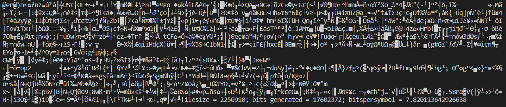
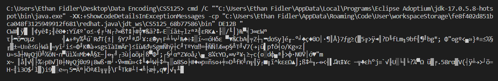
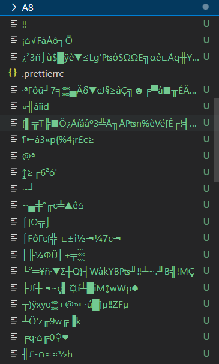

# Assignment 8

Ethan Fidler 3/5/2023

## Output

The test file was loaded properly, but I don't think that the terminal was able to output the entire encoded string; included is an image of the tail of the encoded string.



Inputting both the entire encoded message & the tail of the encoded message did not result in any output in the terminal, but it did create a large amount of junk files. Testing on a test message I defined myself caused the program to crash.





## Code

```java

import java.io.*;
import java.util.*;

class Node implements Comparable<Object>{
  Node left, right;
  int symbol;
  int frequency;
  public Node(Node l, Node r, int s, int f){
    left = l; right = r; symbol = s; frequency = f;
  }
  public int compareTo(Object obj){
   Node n = (Node)obj;
   return frequency - n.frequency;
  }
}

public class DE12A{

  static final int numberOfSymbols = 256;
  static final int blockSize = 4096;
  int[] freq = new int[numberOfSymbols];
  Node tree = null;
  String[] codewords = new String[numberOfSymbols];
  int[][] codetree = null; // Huffman tree with actualNumberOfSymbols leaves 
  int buf = 0; int position = 0;  // used by outputbits()
  int actualNumberOfSymbols = 0;  // number of symbols with freq > 0
  int filesize = 0;
  int sizeOfCompressed = 0;

  void count(String filename){ // count symbol frequencies
    byte[] buffer = new byte[blockSize];
    FileInputStream fis = null;
    try {
      fis = new FileInputStream(filename);
    } catch (FileNotFoundException e){
      System.err.println(filename + " not found");
      System.exit(1);
    }
    int len = 0;
    for (int i = 0; i < numberOfSymbols; i++) freq[i] = 0;
   try {
    while ((len = fis.read(buffer)) >= 0){
      for (int i = 0; i < len; i++)
       freq[Byte.toUnsignedInt(buffer[i])]++;
      filesize += len;
    }
    fis.close();
   } catch (IOException e){
      System.err.println("IOException");
      System.exit(1);
   }
  }

 void entropy(){
   double sum = 0;
   for (int i = 0; i < numberOfSymbols; i++) if (freq[i] > 0){
     actualNumberOfSymbols++;
     sum += freq[i] * Math.log(((double)freq[i]) / filesize);
   }
   sum /= filesize * Math.log(2.0);
   System.err.println("actual number of symbols = " + actualNumberOfSymbols + "; entropy = " + -sum);
 }

  void makeTree(){  // make Huffman prefix codeword tree
   PriorityQueue<Node> pq = new PriorityQueue<Node>();
   for (int i = 0; i < numberOfSymbols; i++) if (freq[i] > 0){
       actualNumberOfSymbols++;
       pq.add(new Node(null, null, i, freq[i]));
   }
   int nodeLabel = numberOfSymbols;
   while (pq.size() > 1){
     Node a = pq.poll(); Node b = pq.poll();  // remove two subtress
     pq.add(new Node(a, b, nodeLabel++, a.frequency + b.frequency)); 
        // add the merged subtree
   }
   tree = pq.poll();  // root of tree as the last single subtree
  }

  void dfs(Node n, String code){  // generate all codewords
    if (n.symbol >= numberOfSymbols){  // internal node
      dfs(n.left, code + "0"); dfs(n.right, code + "1");
    }else codewords[n.symbol] = code;  // leaf
  }

  void makeCodewords(){
    dfs(tree, "");
  }

 void buildTreeArray(){  // make an array for the tree
  codetree = new int[actualNumberOfSymbols * 2 - 1][2];
  int treeSize = 1;
  for (int i = 0; i < actualNumberOfSymbols * 2 - 1; i++)
    codetree[i][0] = codetree[i][1] = 0;
  for (int i = 0; i < numberOfSymbols; i++) 
   if (codewords[i] != null){
    int len = codewords[i].length();
    int k = 0;
    for (int j = 0; j < len; j++){
      int side = codewords[i].charAt(j) - '0';
      if (codetree[k][side] <= 0) codetree[k][side] = treeSize++;
      k = codetree[k][side];
    }
    codetree[k][1] = i;
  }
 }
    
  void outputTree(){
    System.out.write(actualNumberOfSymbols);  // number of used symbols
    for (int i = 0; i < actualNumberOfSymbols * 2 - 1; i++){  // Huffman tree
      System.out.write(codetree[i][0]);
      System.out.write(codetree[i][1]);
    }
    int fs = filesize;
    for (int i = 0; i < 3; i++){  // three bytes for filesize
      System.out.write(fs & 0xff);
      fs >>= 8; 
    }
  }
    
  void encode(String filename){ // compress filename to System.out
    byte[] buffer = new byte[blockSize];
    FileInputStream fis = null;
    try {
      fis = new FileInputStream(filename);
    } catch (FileNotFoundException e){
      System.err.println(filename + " not found");
      System.exit(1);
    }
    int len = 0;
   try {
    while ((len = fis.read(buffer)) >= 0)
      for (int i = 0; i < len; i++)
       outputbits(codewords[Byte.toUnsignedInt(buffer[i])]);
    fis.close();
   } catch (IOException e){
      System.err.println("IOException");
      System.exit(1);
   }
    if (position > 0){ System.out.write(buf << (8 - position)); }
    System.out.flush();
    System.err.println("filesize = " + filesize + "; bits generated = " + sizeOfCompressed + "; bitspersymbol = " + ((sizeOfCompressed * 1.0)/filesize));
  }

  void outputbits(String bitstring){ // output codeword
     sizeOfCompressed += bitstring.length();
     for (int i = 0; i < bitstring.length(); i++){
      buf <<= 1;
      if (bitstring.charAt(i) == '1') buf |= 1;
      position++;
      if (position == 8){
         position = 0;
         System.out.write(buf);
         buf = 0;
      }
     }
  }
    

  public static void main(String[] args){
    if (args.length < 1){
     System.err.println("Usage: java DE12A original > encoded");
     return;
    }
    DE12A de12 = new DE12A();
    de12.count(args[0]);
    de12.entropy();
    de12.makeTree();
    de12.makeCodewords();
    de12.buildTreeArray(); 
    de12.outputTree();
    de12.encode(args[0]); 
  }
}
```

```java
import java.io.*;
import java.util.*;

public class DE12B{

  int[][] codetree = null;
  int buf = 0; int position = 0;
  int actualNumberOfSymbols = 0;
  int filesize = 0;

 void readTree(){  // read Huffman tree
  try{
   actualNumberOfSymbols = System.in.read();
   codetree = new int[actualNumberOfSymbols * 2 - 1][2];
   for (int i = 0; i < actualNumberOfSymbols * 2 - 1; i++){
     codetree[i][0] = System.in.read();
     codetree[i][1] = System.in.read();
   }
   for (int i = 0; i < 3; i++){  // read filesize
     int a = System.in.read();
     filesize |= a << (i * 8);
   }
  } catch (IOException e){
     System.err.println(e);
     System.exit(1);
  }
 }

 int inputBit(){ // get one bit from System.in
   if (position == 0)
     try{
       buf = System.in.read();
       if (buf < 0) return -1;
       position = 0x80;
     }catch(IOException e){
        System.err.println(e);
        return -1;
     }
   int t = ((buf & position) == 0) ? 0 : 1;
   position >>= 1;  
   return t;
 }

 void decode(){  // Your two lines of code for updating k are needed for this to work.
  int bit = -1;   // next bit from compressed file: 0 or 1.  no more bit: -1
  int k = 0;  // index to the Huffman tree array; k = 0 is the root of tree
  int n = 0;  // number of symbols decoded, stop the while loop when n == filesize

  while ((bit = inputBit()) >= 0){
    // Your code: replace k by the index of a child according to bit (Walk down tree)

    k ^= bit;
    if (codetree[k][0] == 0){  // leaf
       System.out.write(codetree[k][1]);
       if (n++ == filesize) break; // ignore any additional bits
       // Your code: restart for the next symbol by move to the root (Go up to root)
       k = 0;
    }
  }
  System.out.flush();
 }

 public static void main(String[] args){
  DE12B de12 = new DE12B();
  de12.readTree();
  de12.decode(); 
 }
}
```